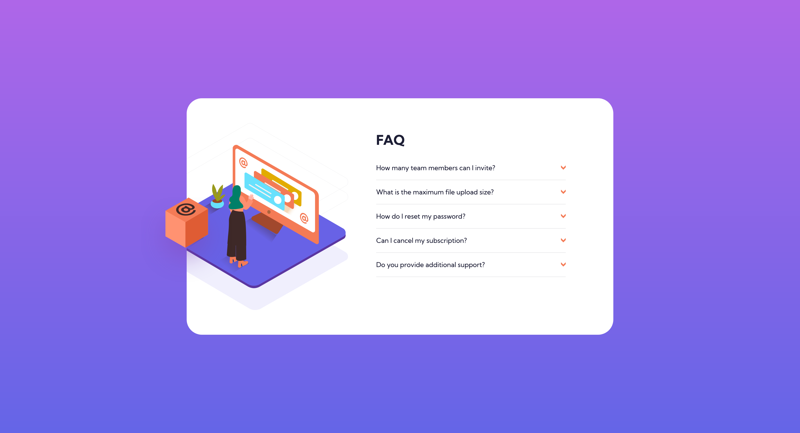

### Links

- [Solution URL](https://www.frontendmentor.io/solutions/faq-accordion-card-_aznseSvUE)
- [Live Site URL](https://smgy94.github.io/frontend-mentor-faq-accordion-card-main/)

# Frontend Mentor - FAQ accordion card solution

This is a solution to the [FAQ accordion card challenge on Frontend Mentor](https://www.frontendmentor.io/challenges/faq-accordion-card-XlyjD0Oam). Frontend Mentor challenges help you improve your coding skills by building realistic projects.

## Table of contents

- [Links](#links)
- [The challenge](#the-challenge)
- [Screenshot](#screenshot)
- [Built with](#built-with)
- [Author](#author)

### The challenge

Users should be able to:

- View the optimal layout for the component depending on their device's screen size
- See hover states for all interactive elements on the page
- Hide/Show the answer to a question when the question is clicked

### Screenshot

### Built with

- Semantic HTML5 markup
- CSS custom properties
- Flexbox
- CSS Grid
- JavaScript
- Mobile-first workflow

## Author

- LinkedIn - [@shanemcgeown](https://www.linkedin.com/in/shanemcgeown/)
- Frontend Mentor - [@smgy94](https://www.frontendmentor.io/profile/Smgy94)
- Twitter - [@ShaneMcGeown94](https://twitter.com/ShaneMcGeown94)
